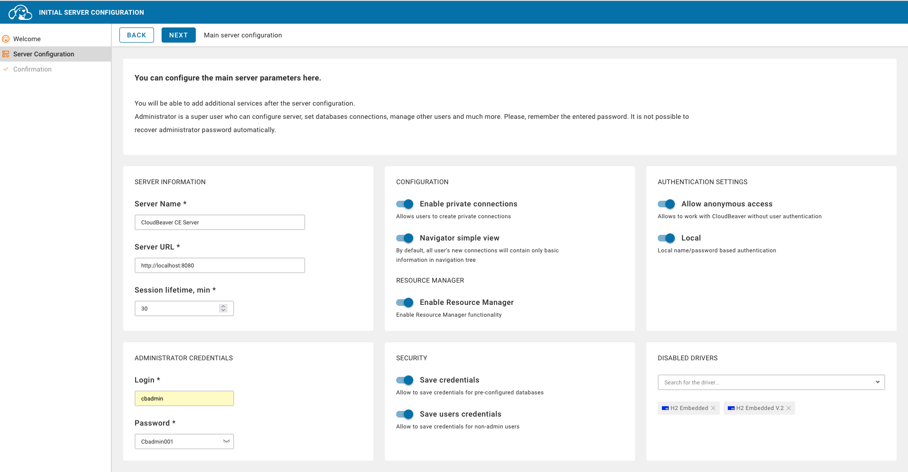

# 🐳 Docker DB Starter Kit  

**Démarrez des bases de données en 1 minute** avec ce kit prêt-à-l'emploi pour développeurs et data engineers !

[](https://github.com/abrahamkoloboe27/Setup-Databases-With-Docker)
[](https://opensource.org/licenses/MIT)

## 🚀 Pourquoi ce projet ?

- ✅ **Dockerisez 6 bases de données** en un seul commande
- ✅ **Configuration optimisée** pour le développement local
- ✅ **Intégration clé-en-main avec DBeaver** (client SQL universel)
- ✅ **Persistence des données** grâce aux volumes Docker

Parfait pour :  
🔧 Prototyper rapidement des applications  
📊 Tester des architectures multi-bases  
🎓 Apprendre les bases de données en local

## 📦 Prérequis

- [Docker](https://docs.docker.com/get-docker/) 🐳 (v20.10+)
- [Git](https://git-scm.com/downloads) 📦
- Terminal Linux/macOS/WSL2 💻
- 2 Go de RAM libres 🧠

## 🛠 Installation rapide

```bash
# 1. Clonez le dépôt
git clone https://github.com/abrahamkoloboe27/Setup-Databases-With-Docker.git
cd Setup-Databases-With-Docker

# 2. Lancez TOUTES les bases de données
make run-all
```


## 🧭 Utilisation de base

### Commandes principales

| Commande                | Action                          | Emoji |
|-------------------------|---------------------------------|-------|
| `make run-all`          | Démarre toutes les bases       | 🚀    |
| `make stop-all`         | Arrête tous les conteneurs     | 🛑    |
| `make clean-all`        | Supprime tout (conteneurs + données) | 💥  |

### Bases disponibles

| Base         | Port  | Identifiants           | Usage typique          |
|--------------|-------|------------------------|------------------------|
| **MySQL**    | 3306  | `root`/`root`          | Apps web               |
| **PostgreSQL** | 1234 | `postgres`/`postgres`  | Données relationnelles |
| **MongoDB**  | 27017 | `mongo`/`mongo`        | Données JSON           |
| **Redis**    | 6379  | -                      | Cache/Sessions         |
| **Cassandra**| 9042  | `cassandra`/`cassandra`| Big Data               |
| **MariaDB**  | 3307  | `mariadb`/`mariadb`    | Alternative MySQL      |

## 🌐 Configuration de DBeaver

Accédez à l'interface web :  
http://localhost:8080



**Configuration MySQL critique** ⚠️ :  
```properties
allowPublicKeyRetrieval = true  
useSSL = false
```

## 🛠 Utilisation avancée

### Lancer une base spécifique
```bash
make run-mysql  # Seulement MySQL
make run-mongo  # Seulement MongoDB
```

### Personnaliser les ports
Éditez le `Makefile` :
```makefile
# Avant
run-postgres:
  -p 1234:5432

# Après
run-postgres:
  -p 5432:5432  # Port standard PostgreSQL
```

### Monitoring des ressources
```bash
watch -n 1 "docker stats --format 'table {{.Name}}\t{{.CPUPerc}}\t{{.MemUsage}}'"
```

## 🚨 Dépannage

**Erreur "Public Key Retrieval" avec MySQL** :  
```bash
# 1. Dans DBeaver > Propriétés du pilote :
allowPublicKeyRetrieval = true  
useSSL = false

# 2. Réinitialiser MySQL
make clean-mysql && make run-mysql
```

## 🤝 Contributions

Les PR sont les bienvenues !  
📌 [Ouvrir une issue](https://github.com/abrahamkoloboe27/Setup-Databases-With-Docker/issues)  
💡 [Proposer une amélioration](https://github.com/abrahamkoloboe27/Setup-Databases-With-Docker/pulls)

## 📄 Licence

MIT License - Voir le fichier [LICENSE](LICENSE)

---

**Créé avec ❤️ par Abraham Koloboe**  
[](https://github.com/abrahamkoloboe27)
[](https://www.linkedin.com/in/abraham-zacharie-koloboe-data-science-ia-generative-llms-machine-learning/)
