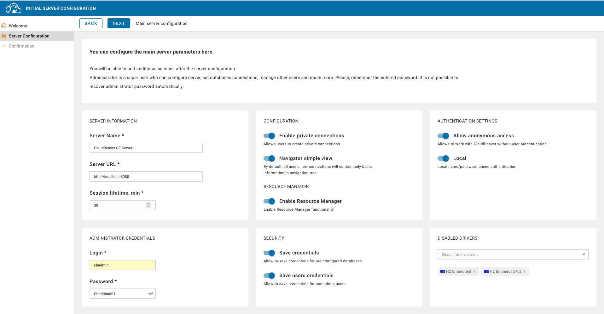

# DBeaver [](https://dbeaver.io)

DBeaver est un client universel et une interface d'administration de bases de données qui supporte plus de 80 systèmes de bases de données différents. 🌟


## Lancement de DBeaver 🚀

### Via le Makefile
```bash
make run-dbeaver
```

Accédez ensuite à l'interface web 🌐:
```
http://localhost:8080
```


### Première configuration ⚙️
1. Créez un compte admin lors du premier accès




2. Configurez vos connexions via le menu "Database"


## Configuration des connexions 🔌

### MariaDB [](https://mariadb.org)


```properties
Type: MariaDB
Host: host.docker.internal ou localhost  
Port: 3307
Database: mariadb
User: mariadb
Password: mariadb
Paramètres avancés :
  allowPublicKeyRetrieval=true
  useSSL=false
```

### PostgreSQL [](https://www.postgresql.org)


```properties
Type: PostgreSQL
Host: host.docker.internal ou localhost  
Port: 1234
Database: postgres
User: postgres
Password: postgres
Paramètres SSL : Désactivé
```

### MySQL [](https://www.mysql.com)


```properties
Type: MySQL
Host: host.docker.internal ou localhost  
Port: 3306
Database: mysql
User: root
Password: root
Paramètres critiques :
  allowPublicKeyRetrieval=true  ➔ Obligatoire
  useSSL=false                  ➔ Recommandé
```


## Fonctionnalités clés 🔑

- Éditeur SQL intelligent avec auto-complétion ✨
- Visualisation des schémas de base de données 📊
- Gestion des utilisateurs et permissions 👥
- Import/Export de données en multiples formats 📤📥
- Monitoring des performances en temps réel 📈


## Dépannage MySQL 🔧

**Erreur "Public Key Retrieval"** :
1. Dans l'onglet "Paramètres du pilote" :
   ```properties
   allowPublicKeyRetrieval = true
   useSSL = false
   ```
2. Redémarrer DBeaver si nécessaire
3. Vérifier que le conteneur MySQL est bien configuré :
   ```bash
   make clean-mysql && make run-mysql
   ```


## Bonnes pratiques ✅

- Utilisez des connexions séparées pour chaque environnement (dev/test/prod)
- Activez le chiffrement SSL pour les connexions externes 🔒
- Sauvegardez régulièrement vos configurations de connexion 💾
- Utilisez les snippets SQL pour les requêtes récurrentes 📝


## Liens utiles 🔗

- [Site officiel DBeaver](https://dbeaver.io/)
- [Documentation complète](https://github.com/dbeaver/dbeaver/wiki)
- [Guide des pilotes JDBC](https://dbeaver.com/docs/wiki/JDBC-Drivers/)


DBeaver simplifie la gestion multi-bases grâce à son interface unifiée. Son support étendu des drivers et ses fonctionnalités d'exploration de données en font un outil indispensable pour les développeurs et DBA. 🚀

